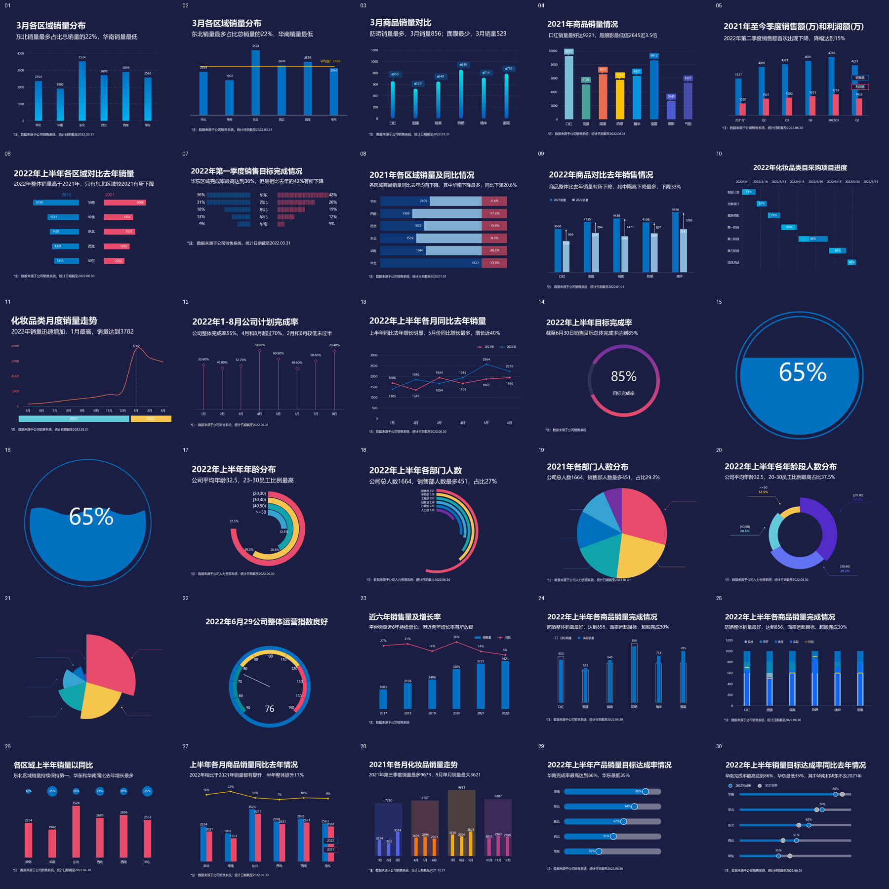
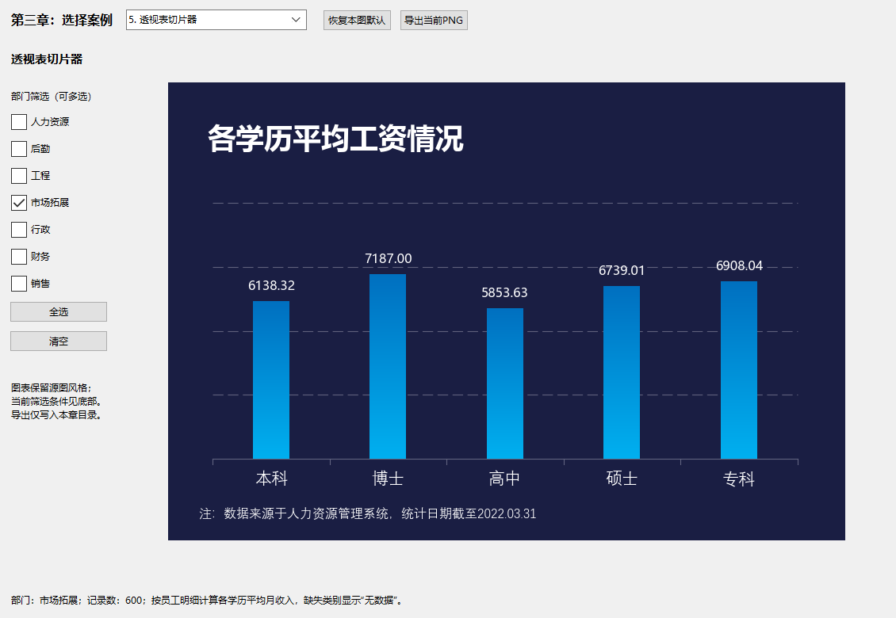
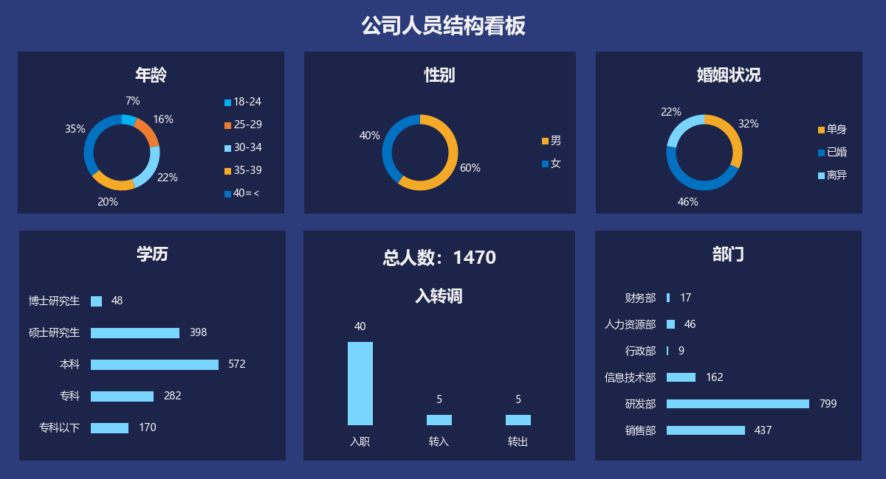
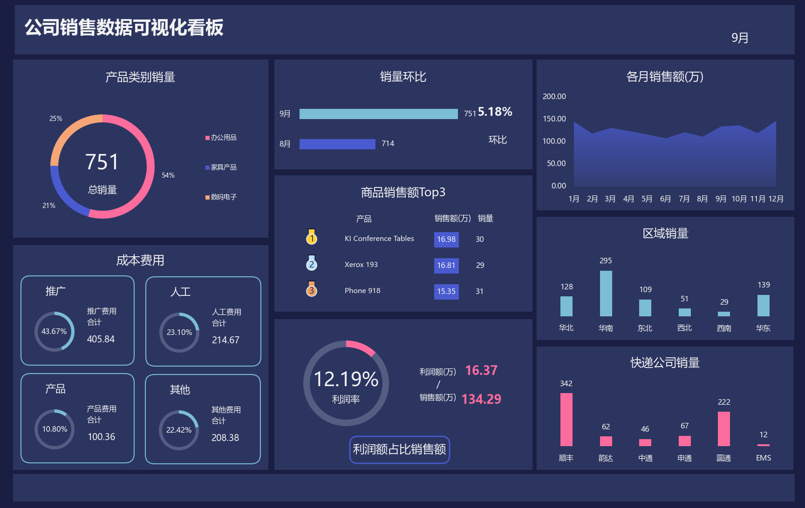

# Python 数据可视化：从 Excel 图表到交互式看板

参考《Excel数据可视化——从图表到数据大屏》，使用 Python 实现 Excel 案例中的图表绘制、交互筛选与多图表看板。项目包含 30 个图表案例、7 个交互式动态图表案例，以及人力资源和销售两个可视化看板，提供实现代码、运行说明与原图对照。

本项目面向可视化实现与技术交流：从读取工作簿数据，到绘制图形、响应交互，再到组合为完整看板。书籍提供案例参考，Python 负责数据处理与图形实现。

## 成果预览

### 图表绘制

渐变柱形图、蝴蝶图、水球图、南丁格尔图等 30 个案例。



### 交互式图表

通过下拉选择、指标勾选和部门筛选更新图表，并导出当前结果。



### 数据可视化看板

组合多个图表与指标卡片，展示人员结构与月度销售情况。





## 模块导航

| 模块 | 参考章节 | 实现内容 | 使用方式 |
| --- | --- | --- | --- |
| [图表绘制](9.3第二章图复现/README.md) | 第二章 | 30 个图表案例 | 单图绘制、批量生成 |
| [交互式图表](第三章动态图表/README.md) | 第三章 | 7 个交互案例 | 本地桌面控件联动 |
| [数据可视化看板](第四章数据可视化看板/README.md) | 第四章 | 2 个看板、17 个组件 | 看板切换、月份筛选与导出 |

## 技术实现

| 技术 | 用途 |
| --- | --- |
| Python | 数据处理、筛选、聚合与程序组织 |
| openpyxl | 读取 Excel 工作簿中的源数据 |
| Matplotlib、NumPy | 图表绘制、渐变效果与数值计算 |
| Tkinter | 本地桌面窗口与交互控件 |
| Pillow | 图像处理、预览与对照图生成 |

图表由 Python 根据源数据绘制。日常运行不需要启动 Excel，也不执行 VBA 宏；仅重新导出 Excel 参考图的辅助工具需要 Windows 上的 Microsoft Excel。

## 快速开始

推荐使用 Windows 桌面环境。已验证 Python 3.13；图形代码使用微软雅黑等中文字体，第三、四章还需要 Tkinter。跨平台字体与窗口适配尚未验证。

下载或克隆完整仓库，保留工作簿的文件名与目录关系。在项目根目录运行以下命令；如果现有环境已满足各章依赖，可跳过安装步骤。

### 图表绘制

```powershell
python -m pip install -r "9.3第二章图复现/requirements.txt"
python "9.3第二章图复现/运行全部30图.py"
```

### 交互式图表

```powershell
python -m pip install -r "第三章动态图表/requirements.txt"
python "第三章动态图表/app.py"
```

### 数据可视化看板

```powershell
python -m pip install -r "第四章数据可视化看板/requirements.txt"
python "第四章数据可视化看板/app.py"
```

详细操作、输出位置和验证命令见各模块 README。

## 项目结构

| 路径 | 内容 |
| --- | --- |
| `9.3第二章图复现/` | 第二章代码、工作簿、结果图与对照材料 |
| `第三章动态图表/` | 第三章代码、交互窗口、测试与对照材料 |
| `第四章数据可视化看板/` | 第四章代码、两个看板、测试与对照材料 |
| `第三章 动态图表.xlsm` | 第三章源工作簿 |
| `第四章 人力资源可视化看板.xlsx` | 人力资源看板源工作簿 |
| `第四章 销售看板参考.xlsx` | 销售看板源工作簿 |
| `ABOUT.md` | GitHub 项目简介的本地副本 |

## 验证方式与已知限制

采用程序运行检查、数据核对和逐图视觉对照验证结果。第三章包含交互状态与导出测试，第四章包含全年月份聚合、组件渲染与窗口测试；具体覆盖范围见各模块说明。

复现尽量保留参考案例的数据、配色、标签与布局，但不承诺逐像素一致。字体抗锯齿、部分标注位置和图标细节可能存在差异。源工作簿中的已知公式或数据口径问题在对应模块中说明，Python 处理不覆盖原工作簿。

当前项目是一组本地可运行的可视化案例，不是通用图表转换器，也不提供实时数据接入服务。

## 参考资料与版权说明

案例参考《Excel数据可视化——从图表到数据大屏》第二至四章及相应工作簿。项目用于可视化方法学习与技术交流，书籍案例设计、原始数据及参考素材的权利归原作者或相应权利人所有；仓库公开不代表授予这些素材的再分发许可。
